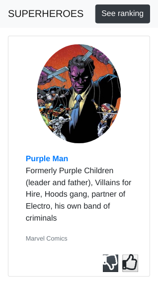
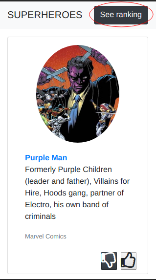
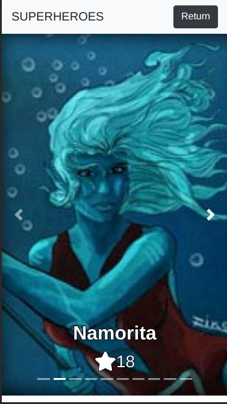
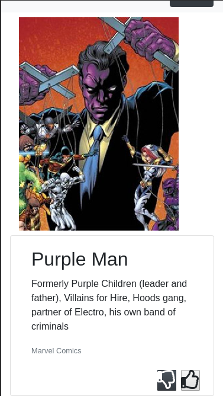
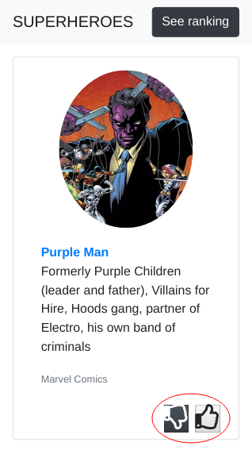
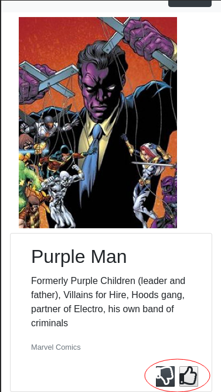

# SuperHeroes
Visor de SuperHeroes

# Instalación
Todo el visor fue desarrollado con el framework **Laravel**
Se requiere instalar entonces en el equipo composer, MySQL, PHP

## Instalación de dependencias
Una vez se tiene instalado composer, dentro de la carpeta del proyecto ejecutar el comando `composer install` que instalará todas las dependencias necesarias

## Generación de key
La aplicación puede necesitar un key, para esto ejecutar dentro de la carpeta del proyecto `php artisan key:generate`

## Base de datos
Para este proyecto que usar MySQL, es necesario crear una base de datos con el nombre `superheroes` y crear un usuario el cual tenga completo acceso a la base de datos con el nombre de usuario: `chef` y contraseña `chef`. Este usuario debe tener total acceso sobre esta base de datos.

## Migraciones 
Ejecutar dentro de la carpeta del proyecto `php artisan migrate --seed`, de está forma se creará las tablas necesarias para el proyecto.

## Restaurar base de datos
Dentro del repositorio en la carpeta raíz, está el archivo `superheroes.csv` que contiene toda la información a importar en la tabla superheroes creada en la migración anterior, se debe importar toda está información del archivo a dicha tabla.

## Ejecución de aplicación
 
Ejecutar `php artisan serve`

# Información adicional del desarrollo de la aplicación

## Home
- url:`/` y por página:`/?page={{pagina}}`

Al final de esta vista, se encuentran las diferentes páginas para navegar entre las tarjetas de heroes

## Ranking de Heroes
- url:`/superheroes/ranking` y desde el Home en el botón `See ranking` 

## Detalle de SuperHeroe
- url:`/superhero/{{idSuperheroe}}` y desde el Home el nombre del superheroe contiene un enlace a su detalle 

## Me gusta o no me gusta

Se puede hacer a través de los iconos de me gusta o no me gusta en el Home donde está el visor de superheroes o a través de del detalle de un superheroe.

Este proceso se almacena desde el **LocalStorage** y actualiza el número de likes también en base de datos.

Para dichos botones, existe una lógica similar a Facebook, donde si por ejemplo se le da like a un superheroe que ya tenía me gusta o no me gusta, el comportamiento en este caso es que se va a deshacer el me gusta o no me gusta. En cualquier otro caso, solo se va a sumar el me gusta o el no me gusta al superheroe.